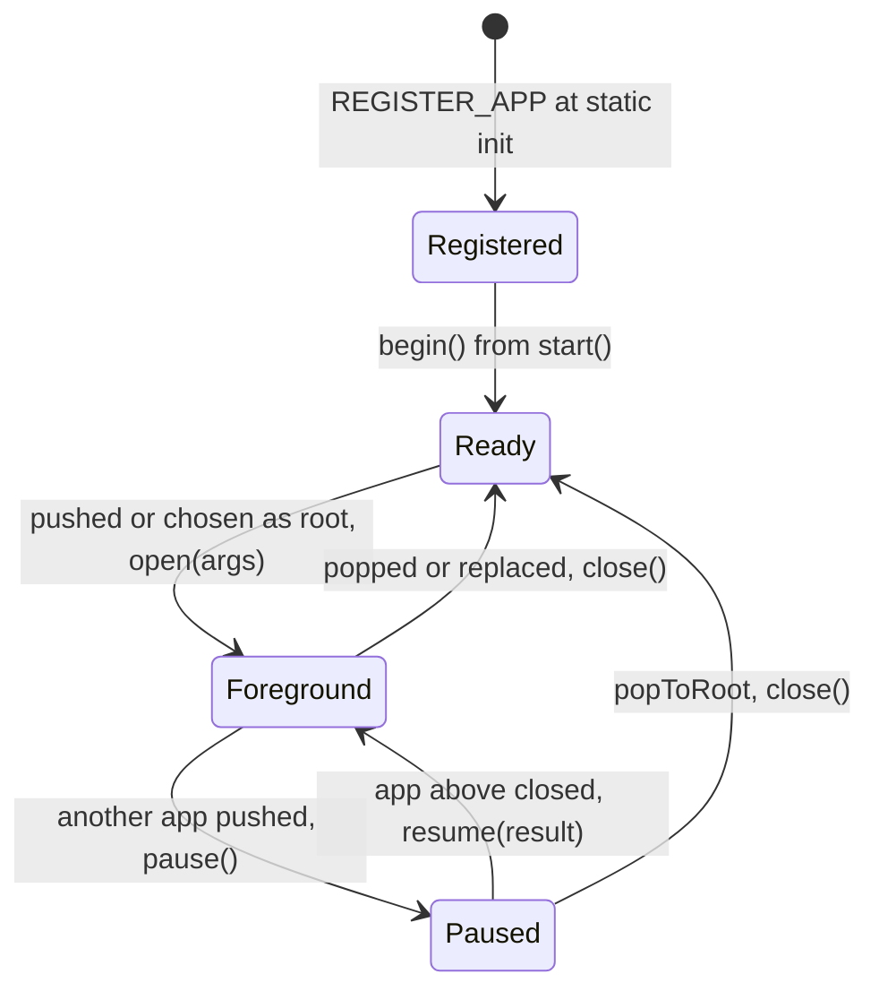
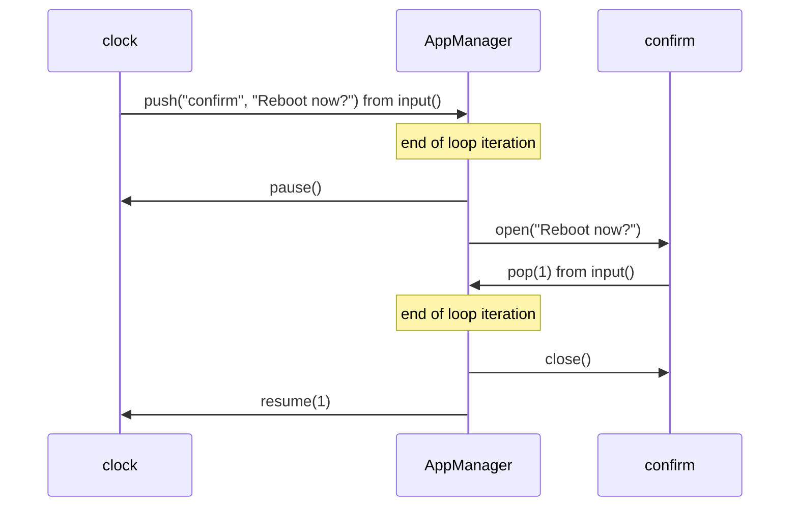

# Apps

[Home](Home.md) / Apps

Apps are how you build a product on esp-base. Each app is a C++ object compiled into the firmware. `AppRegistry` collects the apps at static init time, and `AppManager` runs them from `base.loop()`: it ticks and draws each one at its declared rates, keeps a navigation stack, and applies transitions at the end of the loop iteration. The drawing surface (`Frame`) and the input source belong to your project.

## A minimal app

```cpp
#include <EspBase.h>
#include "Frame.h"   // your definition of struct Frame

class ClockApp : public App {
 public:
  ClockApp() : App({.id = "clock", .name = "Clock", .tickHz = 1, .drawHz = 2, .order = 10}) {}

  void open(const String&) override { requestDraw(); }
  void tick(uint32_t) override { requestDraw(); }          // content changes every second
  void draw(Frame& f) override { /* draw the time into f */ }
  bool input(const InputEvent& ev) override {
    if (ev.type == InputEvent::Press && ev.code == InputCode::Select) {
      manager().push("confirm", "Reboot now?");
      return true;
    }
    return false;                                            // unconsumed Back closes the app
  }
};
REGISTER_APP(ClockApp);
```

Start the manager once, after `base.begin()`:

```cpp
static Frame frame;
base.apps().start(&frame, [](Frame& f) { display.push(f); }, "home");
```

## AppInfo

| Field | Meaning |
| --- | --- |
| `id` | Stable identifier for the console, the API and `boot_app`. Must be unique. |
| `name` | Human readable name, for launchers. |
| `tickHz` | Tick rate. 0 = every loop iteration. |
| `drawHz` | Upper limit on redraws. 0 = no limit. Drawing also needs `requestDraw()`. |
| `order` | Position in the registry, lowest first. |
| `flags` | Any of the flags below. |

| Flag | Effect |
| --- | --- |
| `AppTickInBackground` | Keeps ticking while another app covers it. Use it for timers and players. |
| `AppOverlay` | Draws on top of the app below instead of replacing it. Use it for dialogs and toasts. |
| `AppHidden` | A service. Opened at start, always ticks, never drawn, never on the stack, cannot be opened. |

## Lifecycle



| Callback | Called |
| --- | --- |
| `begin(base)` | Once per app, from `start()`. Register console commands and look up other apps here. |
| `open(args)` | When the app becomes foreground. Services get it once at start. |
| `pause()` | When another app is pushed on top. |
| `resume(result)` | When the app above closes. `result` comes from `pop(result)`, 0 for Back and home. |
| `close()` | When the app is popped, replaced or cleared by `popToRoot()`. |
| `tick(dtMs)` | At `tickHz`. `dtMs` is the real time since the previous tick. |
| `draw(frame)` | When the app is dirty and `drawHz` allows. |
| `input(ev)` | Foreground app only. Return true to consume the event. |

All callbacks run on the loop task.

## One AppManager iteration

1. Queued input goes to the foreground app. An unconsumed Back press pops it, except the root.
2. Due apps tick: the foreground, the services, and paused apps with `AppTickInBackground`. After a stall an app ticks once and resyncs instead of catching up.
3. If any app in the draw chain is dirty and the foreground's `drawHz` allows, the chain draws bottom-up and `present(frame)` is called once.
4. At most one pending transition is applied.
5. The idle timeout pops to the root when no input arrived for `setIdleTimeout(ms)`.

## Navigation

`push(id, args)`, `pop(result)`, `replace(id, args)` and `popToRoot()` are checked immediately and applied in step 4, so an app can close itself from its own `tick()` or `input()`.

A request returns false and logs why when the id is unknown, the app is a service, it is already on the stack, the stack is full (8 entries), it would pop the root, or another transition is already pending. Since only one can be pending, chain navigation by issuing the next request from `open()` or `resume()`.



## Drawing

- The project defines `struct Frame` in the global namespace: a sprite, a canvas, a character grid. The library only passes `Frame&` around.
- The draw chain is the topmost opaque app plus every overlay above it. The whole chain redraws together, so an overlay never has to restore what is under it.
- Nothing draws unless something called `requestDraw()`. A static screen costs nothing.
- `present(frame)` runs once per redraw. Put the display transfer there.
- Headless devices call `start()` without a frame. Apps still tick; `draw()` is never called.

## Input

The project turns buttons, encoders or touch into `InputEvent`s:

```cpp
void loop() {
  base.loop();
  if (selectPressed()) base.apps().key(InputCode::Select);   // your debounced read
}
```

- `input(ev)` is safe from any task and `inputFromISR(ev)` from an interrupt. `key(code, value)` sends a plain press.
- Built-in codes are `Back`, `Select`, `Up`, `Down`, `Left` and `Right`; project codes start at `InputCode::User`. Types are `Press`, `Release`, `LongPress`, `Turn` (value = steps), `Touch` and `Custom`.
- `Back` is the only code the manager interprets.

## Services and shared state

- Other apps find a service with `AppRegistry::find("id")` and a `static_cast`. The example clock reads the heartbeat service this way.
- Per-app settings: a `ConfigStore` with the app id as namespace.
- The root app at start is the stored `boot_app` if set, else the `homeId` passed to `start()`, else the first visible app. `boot_app` changes when the root itself is replaced, or with `app boot <id>`; `app boot -` clears it.

## Timing

The scheduler is cooperative: a slow tick delays everything, WiFi and the console included. A tick slower than the budget (`setTickBudget(us)`, default 20 ms) counts as an overrun and is logged at most every 10 s per app. `app stats` shows loop iterations per second, and per app the tick and draw counts with last and worst times. Split long work across ticks.

## Pitfalls

- An app missing from `app list` was dropped by the linker, which discards objects in a library archive that nothing references. Keep apps in the project's `src/`, or build the apps library with `lib_archive = false`.
- A crash before `setup()` usually means an app constructor logged or used another global. Constructors run during static init, so move that code to `begin()`.
- `REGISTER_APP` needs an unqualified type name. For a type in a namespace, write the two lines yourself: `static ns::MyApp myApp; static AppRegistrar myAppReg(myApp);`.
- `base.apps().start()` must come after `base.begin()`.

## Console and API

`app list|stack|stats|open <id> [args]|replace <id> [args]|close [result]|home|boot [id|-]|key <name|code> [value]`, plus `GET /api/apps` for the registry, stack and stats and `POST /api/apps` with `{"action":"open|replace|close|home|key", ...}`.

## The example

[`examples/minimal/src`](../../examples/minimal/src/) has a 20x4 character `Frame` that is logged whenever it changes, and four apps: a launcher as root, a clock, an overlay confirm dialog and a hidden heartbeat service. With no hardware attached, drive it from the console:

```
app key select   # open the clock from the launcher
app key select   # the confirm dialog opens over the clock
app key back     # dismiss it, the clock resumes with result 0
app key back     # back to the launcher
```
