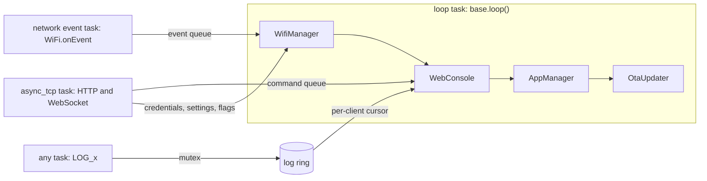

# Architecture

[Home](Home.md) / Architecture

## Modules

| Module | Responsibility | Source |
| --- | --- | --- |
| `EspBase` | Facade. Owns the modules, runs `begin()` and `loop()`, built-in commands, status LED, deferred reboot. | `EspBase.*` |
| `Log` | `LOG_x` macros, serial sink, ring buffer. | `Log.*` |
| `ConfigStore` | Mutex protected wrapper over `Preferences` (NVS). | `ConfigStore.*` |
| `WifiManager` | Radio modes, stored networks, state machine, AP with captive DNS, mDNS, scan. | `WifiManager.*` |
| `WebConsole` | HTTP server, WebSocket, command registry, `/api` routes, embedded page. | `WebConsole.*`, `web/index_html_gz.h` |
| `OtaUpdater` | ArduinoOTA and `POST /update`. Removed by `-DESPBASE_NO_OTA`. | `OtaUpdater.*` |
| `AppRegistry`, `AppManager` | App registration, lifecycle, scheduling, navigation. | `App.h`, `AppRegistry.cpp`, `AppManager.*` |
| `ChipInfo` | The only place with `SOC_*` and `CONFIG_IDF_TARGET` checks. | `ChipInfo.h` |

Reach them through `base.wifi()`, `base.console()`, `base.web()`, `base.config()`, `base.apps()` and `base.ota()`.

## Tasks and hand-offs

Only the loop task changes library state. The other tasks hand their work over.

What this means for your code:

- Console commands run on the loop task. They may call any library API.
- HTTP handlers run on the async_tcp task. Keep them short and never block. For anything that changes device state, set a flag or push to a queue and act on it in `loop()`, the way the built-in routes do.
- `LOG_x` is safe from any task because logging never touches the network stack. It is not allowed from an ISR.
- Every route under `/api/`, plus `/ws` and `/update`, passes the origin check and, with a password, the login before its handler runs. Put routes that change state under `/api/`.

## One loop iteration

`base.loop()` runs these in order, and none of them waits:

1. `WifiManager` starts the driver on the first call, drains WiFi events, applies queued credential and setting changes, runs its timers.
2. `WebConsole` handles WebSocket connects, runs pending commands, streams new log lines, drops the oldest client beyond the limit.
3. `AppManager` delivers input, ticks apps, draws, applies one navigation transition, checks the idle timeout.
4. `OtaUpdater` runs `ArduinoOTA.handle()` and reboots after a finished web upload.
5. Status LED and any scheduled reboot.

`begin()` returns within a few milliseconds. The WiFi driver starts on the first `loop()` call.

## Rules

The library follows these, and code built on it should too:

1. Nothing blocks. No `delay()` in loop paths, no waiting for the network.
2. The library never touches `Serial`. It writes to the `Print*` in `cfg.logOutput`.
3. No GPIO numbers in `src/`. Pins come from the project.
4. Chip differences go through `ChipInfo` and `SOC_*` capability macros, never chip names. No literal core ids; use `ChipInfo::appCore()`.
5. Partitions, PSRAM and USB flags belong to the project.
6. Warning free with `-Wall -Wextra` on every target.

## Resource budget

Measured on the bundled example:

| Item | Size |
| --- | --- |
| Static RAM | 44 to 54 KB depending on the chip |
| Flash | 1.08 to 1.24 MB |
| Web page | about 6 KB gzipped, budget 20 KB |
| Log ring | 4 KB (`logBufferBytes`) |
| WebSocket clients | 4 (`maxWsClients`) |
