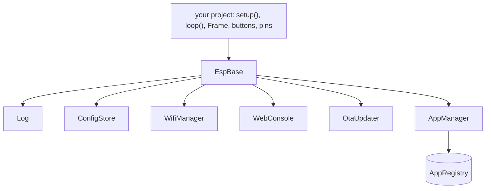

# esp-base wiki

esp-base is an Arduino library that gives every ESP32 project the same baseline: WiFi with a captive portal fallback, a browser console with live logs and commands, OTA updates, persistent settings, structured logging and a small app framework. Your project keeps everything hardware specific: pins, display, input, partitions and USB flags.

| Page | Read it to |
| --- | --- |
| [Getting started](Getting-Started.md) | add the library to a project, flash it, update it |
| [Architecture](Architecture.md) | understand the modules, the tasks and the rules they follow |
| [WiFi](WiFi.md) | know how the device connects, falls back and retries |
| [Console and API](Console-and-API.md) | use the web console, add commands and HTTP routes |
| [Apps](Apps.md) | build your application on the app framework |
| [Logging and config](Logging-and-Config.md) | log, persist settings, look up a key or config field |
| [Development](Development.md) | work on esp-base itself: build, web UI, CI, release |
| [Troubleshooting](Troubleshooting.md) | fix a known symptom |

## At a glance

`EspBase` owns every module. You call `base.begin(cfg)` once and `base.loop()` forever; nothing blocks.

Targets: ESP32, ESP32-S3 and ESP32-C3 are hardware tested; ESP32-C6 and ESP32-S2 are build tested. Toolchain: pioarduino 55.03.311 (Arduino core 3.3.11, ESP-IDF 5.5.5). The [README](../../README.md) is the complete reference; this wiki explains how things work.
