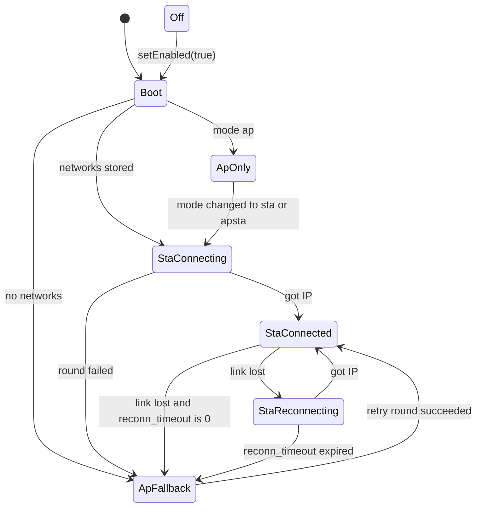

# WiFi

[Home](Home.md) / WiFi

## Modes

| `wifi_mode` | Station | Access point |
| --- | --- | --- |
| `sta` (default) | connects to the stored networks | only as a fallback when none connects |
| `apsta` | connects to the stored networks | always on |
| `ap` | never used | always on |

Set it with `cfg.wifiMode`, the console (`wifi mode ap`) or the WiFi tab. A stored value overrides `cfg` and a change applies without a reboot.

## State machine



`setEnabled(false)` leads to `Off` from every state.

The state machine is event driven. WiFi events are queued and handled in `loop()`; it never polls `WiFi.status()`.

## Stored networks and rounds

- Up to five networks are stored in slots. Slot 1 is the primary (`sta_ssid`, `sta_pass`); slots 2 to 5 are backups (`sta2_ssid` and so on).
- A **round** tries every stored network in slot order, each for at most `sta_timeout`. No scan is involved, so hidden networks work.
- When a round fails in mode `sta`, the AP comes up and rounds repeat every `ap_retry`. The AP stays up during retries and closes 3 s after the station connects.
- When the link drops, the network that was connected is retried first with a 1, 2, 4 .. 30 s backoff, rotating through the others, for `reconn_timeout`. After that the AP comes up and rounds continue next to it.
- Adding a network while in AP fallback starts a round at once. `wifi set` connects to that network immediately.

## Timers

| Key | Default | Range | 0 means |
| --- | --- | --- | --- |
| `sta_timeout` | 20 s | 3 to 300 s | not allowed |
| `reconn_timeout` | 60 s | 0 to 3600 s | AP immediately after a lost link, retries continue |
| `ap_retry` | 60 s | 5 to 3600 s | no automatic retries, use `wifi reconnect` |

Values are stored in milliseconds. With several unreachable networks, the first AP appears after about the number of networks times `sta_timeout`.

## Access point and captive portal

- SSID `<apSsidPrefix>-XXXX` from the last two MAC bytes, address `192.168.4.1`, up to 4 clients. Open, or WPA2 when `ap_pass` has 8 to 63 characters.
- A DNS server answers every name with the AP address. Connectivity probes from Android, Apple, Windows and Firefox get a redirect to the portal. Requests addressed to the AP IP are served normally.
- The chip has one radio. While the station scans or connects, the AP pauses for a second or two and follows the router's channel, so portal clients may drop briefly during retries.

## Scans

`startScan()`, `wifi scan` and `POST /api/wifi/scan` file a request from any task; the loop task starts it. One radio operation runs at a time:

- A scan is refused while another scan or a connection attempt is in flight. One filed just before an attempt begins, or before the driver's first start, waits for that.
- A connection attempt, a retry round included, waits for a running scan. `esp_wifi_connect()` would abort it.
- `setEnabled()`, either way, waits for a running scan.
- While the radio is off, a scan gets the radio for its own duration, as a station that never connects. That is the only case in which a scan powers the radio down again.

Every accepted scan ends in `onScanDone`. AP start and stop are not part of this; the AP pauses while the station scans, as described above.

## Radio off

`base.wifi().setEnabled(false)` or `wifi off` drops the station and the AP and stops the WiFi driver. It is for a project that needs the one radio for BLE, or the battery for longer.

- The state is `off`. `onDisconnected` fires if the station was connected.
- The web console, the API, mDNS and OTA are unreachable until the radio is back. Keep a way to turn it on: a key, a timer or the serial console.
- While off, `wifi set|add|remove|forget` and the settings are stored only.
- A scan still works, see [Scans](#scans). The state stays `off`.
- `setEnabled(true)` or `wifi on` starts over as after boot: stored networks first, then the AP fallback.
- It is not persisted. WiFi is on after every boot.

## Status LED

With `cfg.statusLedPin` set, the LED blinks fast while connecting or reconnecting, slowly in AP mode, and briefly every 3 s when connected. It stays dark while the radio is off.

## From code

```cpp
base.wifi().onConnected([] { LOG_I("up: %s", WiFi.localIP().toString().c_str()); });
base.wifi().onDisconnected([] { /* ... */ });
base.wifi().onApStarted([] { /* ... */ });

base.wifi().setCredentials("Home", "secret");     // slot 1, connect now
base.wifi().addCredentials("Office", "secret2");  // first free slot, returns the slot or 0
String err;
base.wifi().applySetting("ap_retry", "0", err);   // same validation as the console

base.wifi().setEnabled(false);                    // radio off, state Off
base.wifi().setEnabled(true);                     // starts over as after boot

base.wifi().onScanDone([] {                       // the driver still holds the results here
  for (int i = 0; i < WiFi.scanComplete(); ++i) { /* WiFi.BSSID(i), WiFi.RSSI(i), WiFi.channel(i) */ }
});
base.wifi().startScan(60, false);                 // at most 60 ms per channel, nothing logged
```

`startScan()` works in every state, the radio being off included. Its defaults are the console's: up to 300 ms per channel, results in the log. Every scan it accepted ends in `onScanDone`, which may start the next one; `WiFi.scanComplete()` is negative in there when the scan failed.

Callbacks run on the loop task. The setters are safe from any task; the state machine applies them in `loop()`.

## Managing networks

| Task | Console | HTTP |
| --- | --- | --- |
| Show state and networks | `wifi status`, `wifi list` | `GET /api/wifi` |
| Set primary and connect | `wifi set <ssid> [pass]` | `POST /api/wifi {"ssid","pass"}` |
| Add a backup (or update a stored password) | `wifi add <ssid> [pass]` | `POST /api/wifi {"ssid","pass","connect":false}` |
| Remove one | `wifi remove <slot>` | `DELETE /api/wifi?slot=n` |
| Connect now | `wifi reconnect [slot]` | `POST /api/wifi {"slot":n}` |
| Mode and timers | `wifi mode <m>`, `config set ap_retry 0` | `POST /api/wifi/settings` |
| Remove all | `wifi forget` | none |
| Scan | `wifi scan` | `POST` then `GET /api/wifi/scan` |
| Radio off and on | `wifi off`, `wifi on` | none |
